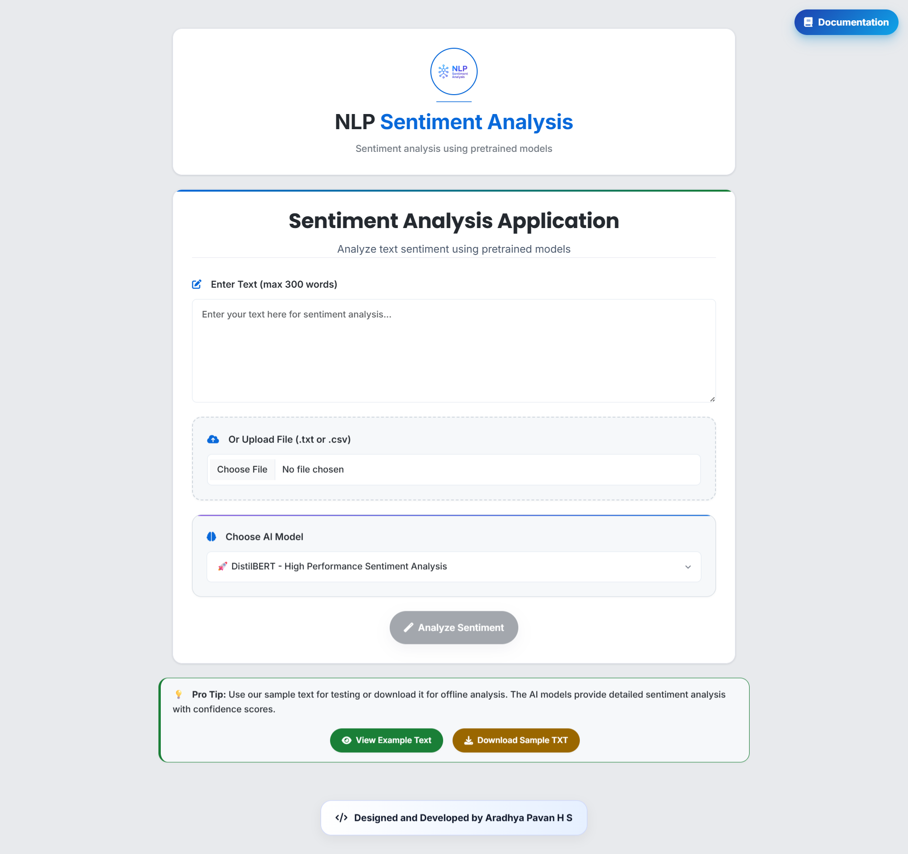
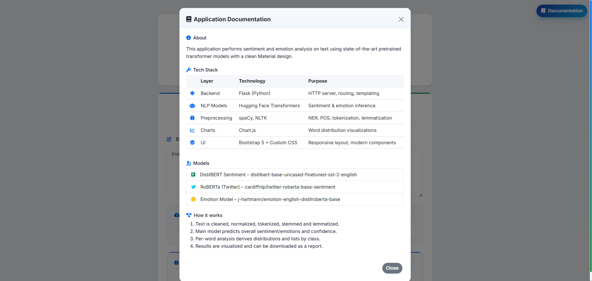
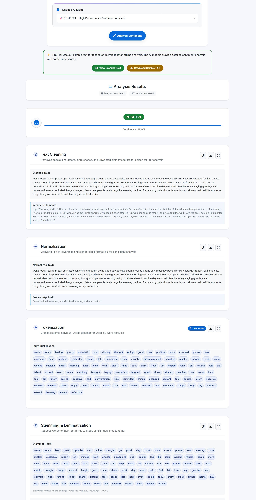
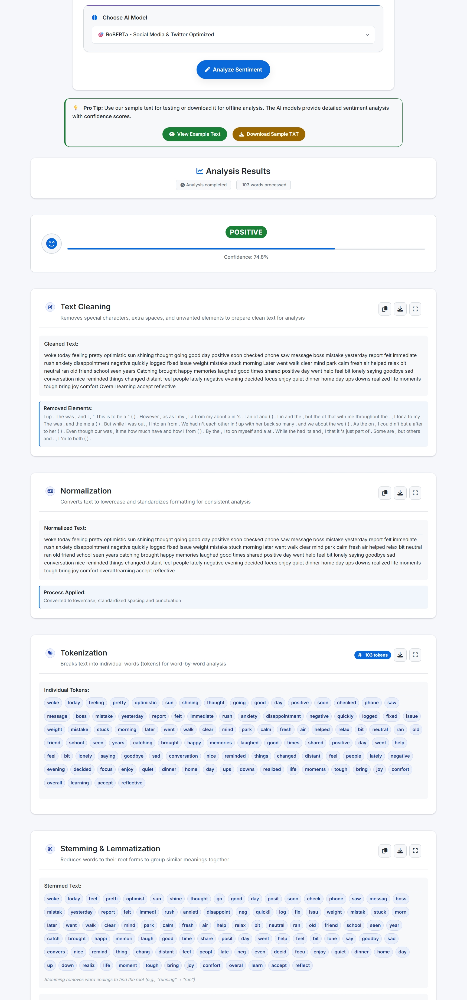
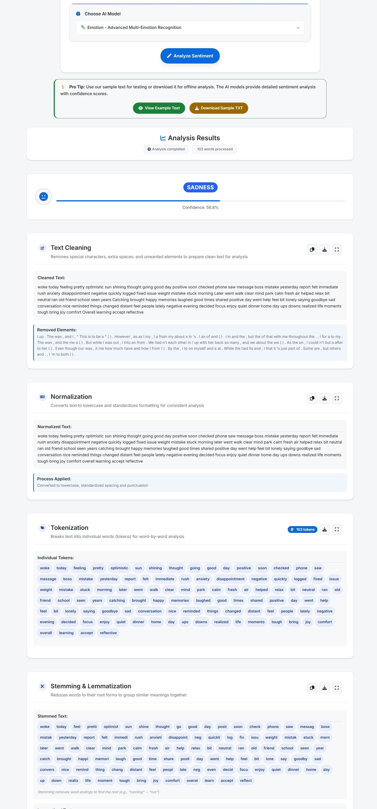

## NLP Sentiment Analysis (Pretrained Models)

An interactive Flask web app for sentiment and emotion analysis using pretrained Transformer models. It performs full NLP preprocessing (cleaning, tokenization, stemming, lemmatization, POS, NER), visualizes a word cloud, persists results in SQLite, and lets you download a detailed analysis report.

### What it does
- **Enter or upload text** and choose a model: default (DistilBERT SST-2), RoBERTa (Twitter), or Emotion (7 classes)
- **Preprocess pipeline**: cleaning, normalization, tokenization, stemming, lemmatization, NER, POS
- **Inference**: overall sentiment/emotion + per-word distribution
- **Visualization**: word cloud generation
- **Persistence**: results stored in `SQLite` via `SQLAlchemy`
- **Export**: download a comprehensive TXT report

### Tech stack
- **Frontend**: HTML, CSS (Bootstrap), JavaScript (Chart.js)
- **Backend**: Flask, Flask-SQLAlchemy
- **NLP**: spaCy, NLTK, Transformers
  - Models: DistilBERT SST-2, CardiffNLP Twitter RoBERTa, GoEmotions DistilRoBERTa
- **Tokenizers**: NLTK tokenizers, Hugging Face tokenizers
- **ML runtime**: PyTorch (torch, CPU wheels), NumPy
- **Visualization**: wordcloud (image), matplotlib (dependency), Chart.js (charts)
- **Packaging/Runtime**: Python 3.11, Gunicorn, Docker support

### Application structure
```
upload/
  app.py                     # Flask entrypoint and routes
  sentiment_model.py         # Preprocessing + model loading/inference
  requirements.txt           # Python dependencies (incl. spaCy model wheel)
  Procfile                   # Gunicorn command
  runtime.txt                # Python version (3.11)
  Dockerfile                 # (optional) containerization
  instance/
    sentiment_data.db        # SQLite DB (created at runtime if missing)
  templates/
    index.html               # Main UI
  static/                    # CSS, images, wordcloud output
  nltk_data/                 # Bundled NLTK data (also downloaded at runtime if needed)
```


### Prerequisites
- Python 3.11
- Git

Note: The repo installs `spaCy` and the `en_core_web_md` model from a wheel URL specified in `requirements.txt` (no extra step required).

### Clone and run locally
```bash
git clone https://github.com/aradhyapavan/nlp-sentiment-analysis-pretarined-models.git
cd nlpa-assignment-2-group-23-sentiment-analysis-main/upload/github/upload

# (recommended) create and activate a virtual environment
python -m venv .venv
. .venv/Scripts/activate  # Windows PowerShell: .venv\\Scripts\\Activate.ps1

# install dependencies
pip install --upgrade pip
pip install -r requirements.txt

# run the app (Flask/Gunicorn not required; app runs directly)
python app.py
# App will start on 0.0.0.0:7860 (http://localhost:7860)
```

### Usage notes
- Minimum input length: 4 words; maximum: 300 words
- Models:
  - `default`: DistilBERT SST-2 (POSITIVE/NEGATIVE)
  - `roberta`: CardiffNLP Twitter RoBERTa (NEGATIVE/NEUTRAL/POSITIVE)
  - `emotion`: 7 emotions (ANGER, DISGUST, FEAR, JOY, NEUTRAL, SADNESS, SURPRISE)
- The app generates `static/wordcloud.png` and stores analysis rows in SQLite

### Models
- DistilBERT (SST-2): [distilbert-base-uncased-finetuned-sst-2-english](https://huggingface.co/distilbert-base-uncased-finetuned-sst-2-english)
- RoBERTa (Twitter): [cardiffnlp/twitter-roberta-base-sentiment](https://huggingface.co/cardiffnlp/twitter-roberta-base-sentiment)
- GoEmotions (English): [j-hartmann/emotion-english-distilroberta-base](https://huggingface.co/j-hartmann/emotion-english-distilroberta-base)

### Deployment
- The app is configured for container or Procfile-based hosts (via `Dockerfile` and `Procfile`).
- It also runs well on Hugging Face Spaces (port defaults to `7860`).

#### Deployed on Hugging Face
The live demo is available here:

`https://huggingface.co/spaces/aradhyapavan/nlp-sentiment-analysis-pretarined-models`

### Environment and ports
- Default port: `7860` (overridable via `PORT` env var)
- NLTK data directory is set at runtime and downloaded if missing

### Screenshots (folder: `snapshot/`)
- Home page  
  
- Documentation modal  
  
- Analyzed result — DistilBERT  
  
- Analyzed result — RoBERTa  
  
- Analyzed result — GoEmotions  
  


### Credits
Designed and developed by Aradhya Pavan H S — GitHub: [aradhyapavan](https://github.com/aradhyapavan)


